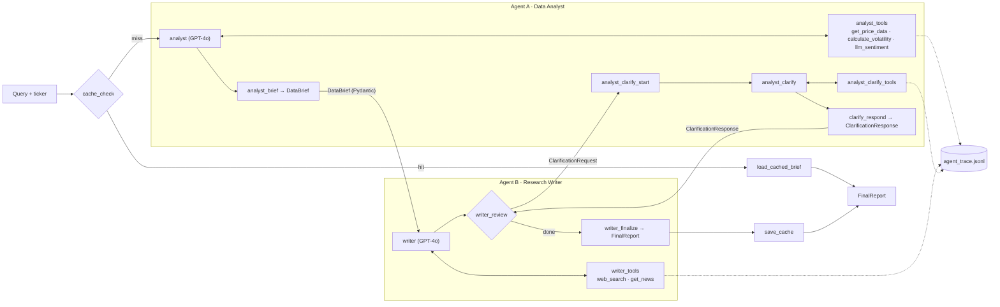
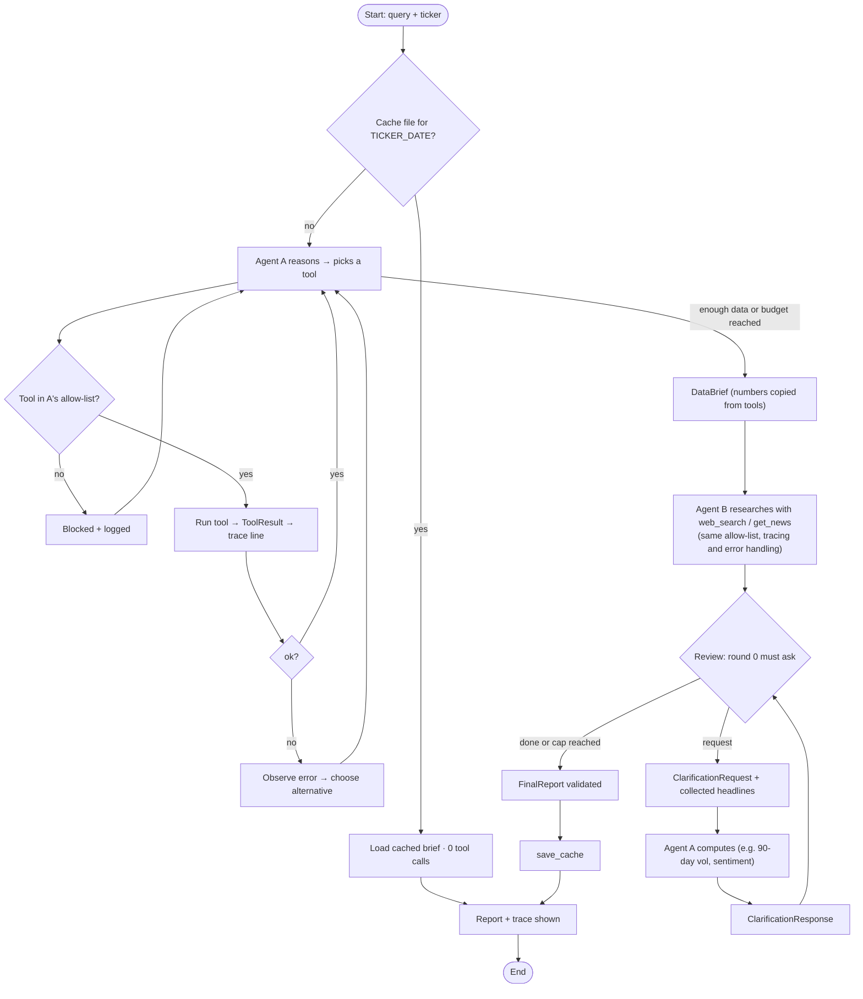

# Multi-Agent Financial Research System

A LangGraph system that researches a listed company with tool-using AI agents. Given a ticker, it answers:

> *Analyse the current financial health and market sentiment of NVDA. Identify the top three risks to its share price over the next 90 days and suggest one data-driven hedge strategy.*

The system has three parts:

| Part | What it does |
|---|---|
| **3A · Research agent** | One autonomous agent chooses among five tools, observes each result, decides its next step and writes a structured report |
| **3B · Two-agent pipeline** | A Data Analyst and a Research Writer with separate tools exchange typed messages and run a critique loop before the final report |
| **3C · Memory and observability** | Short-term memory for follow-up questions, a persistent cache per ticker and day, and a JSON trace of every tool call |

## Tech stack

| Area | Technology |
|---|---|
| Orchestration | LangGraph `StateGraph`, `MemorySaver` checkpointer |
| LLM | OpenRouter (OpenAI-compatible API), `openai/gpt-4o` by default, set with `OPENROUTER_MODEL` |
| Market data | yfinance (prices, fundamentals, news), Yahoo and Google News RSS as fallbacks |
| Web search | DuckDuckGo via `ddgs` |
| Validation | Pydantic v2 for every tool result, LLM output and agent-to-agent message |
| Testing | pytest with a scripted fake LLM (runs offline, no API key) |

**Main outputs:** the executed notebook [`task3_agentic/task3_agentic.ipynb`](task3_agentic/task3_agentic.ipynb) and the trace file [`task3_agentic/logs/agent_trace.jsonl`](task3_agentic/logs/agent_trace.jsonl).

---

## Architecture



The single research agent (3A) is a simpler loop, `agent ⇄ tools → finalize`. It has all five tools and uses the same tool executor and tracing.

### Step-by-step flow



Short-term memory is demonstrated on the single research agent (3A): `ResearchAgent.ask()` sends a follow-up on the same `thread_id`, and the answer comes from the checkpointed conversation without a new tool call.

---

## Features

The "Where to see it" column refers to sections (§) of the executed notebook. Code paths are relative to `task3_agentic/src/agentic/`.

### 3A · Research agent

| Feature | Implementation | Where to see it |
|---|---|---|
| Five tools | `tools/`: `get_price_data`, `get_news`, `calculate_volatility`, `llm_sentiment`, `web_search` | §1: each tool called, result validated as `ToolResult` |
| Autonomous tool selection | `agents/research_agent.py`; the prompt `RESEARCH_AGENT_SYSTEM` states goals and rules but no tool order | §2 prints the order the model chose |
| Observe → replan | `react_turn` prints a `Thought:` before every tool call | §2–§3: `Thought → CALL → ok/ERROR → Thought…` |
| Structured report | `schemas.ResearchReport`: exactly 3 risks with at least 2 pieces of evidence each, plus a hedge with sizing math | §2 rendered report |
| Error handling | Tools never raise; failure injection with `failing()`; LLM retries and validation repair; fallback report built from tool data | §3: `get_news` forced to fail, agent switches tool |

### 3B · Two-agent pipeline

| Feature | Implementation | Where to see it |
|---|---|---|
| Separate roles, restricted tools | `tools.ANALYST_TOOLS` / `WRITER_TOOLS`, enforced by the `ToolExecutor` allow-list | §5: writer's `get_price_data` call blocked and logged |
| Typed handoff | `DataBrief`, `ClarificationRequest`, `ClarificationResponse` (Pydantic) | §4 prints the typed objects |
| Visible message trace | `observability/printer.py` | `[ANALYST]`, `[WRITER]`, `[HANDOFF a -> b]` lines |
| Critique loop | `writer_review` → `analyst_clarify*` → `clarify_respond` → `writer_review` | §4: request, response, `clarification_used=True` |
| End-to-end automation | `ResearchPipeline.run()` / `run_pipeline()` | One call from query to report, no manual steps |

### 3C · Memory and observability

| Feature | Implementation | Where to see it |
|---|---|---|
| Short-term memory | `MemorySaver` keyed by `thread_id`; `ResearchAgent.ask()` | §6: tool-call count and trace lines unchanged after a follow-up |
| Persistent cache | `memory/cache.py`; `cache_check` is the graph's entry node | §7: second run is a cache hit with 0 tool calls |
| Tool trace | `observability/tracer.py` writes `logs/agent_trace.jsonl` | §8 and the committed trace file |
| Trace dashboard | `dashboard.py` (Streamlit); LangSmith through environment variables | `streamlit run dashboard.py` |

Each trace line records the tool, its arguments, the output (truncated to 200 characters), the duration, the agent, the run and the status:

```json
{"ts": "...", "run_id": "...", "session": "...", "agent": "analyst", "kind": "tool",
 "tool": "calculate_volatility", "args": {"ticker": "NVDA", "window": 30},
 "output": "{\"ticker\": \"NVDA\", \"annualised_vol\": ...", "duration_ms": 312.4, "status": "ok"}
```

---

## Design decisions

* **Explicit graphs instead of `create_react_agent`.** Routing, tool budgets, the critique loop and the cache shortcut are real edges you can read in `pipeline.py`. A custom `ToolExecutor` replaces the prebuilt `ToolNode`, so the allow-list, tracing and call counting live in one place.
* **Tools never raise.** Every tool returns `ToolResult{ok, data, error}`. An error becomes an observation the agent reasons about, which makes fallback behaviour possible.
* **Numbers come from code, not the LLM.** `DataBrief` and `ClarificationResponse` copy figures directly from tool results. The LLM writes only the interpretation, so the handoff cannot contain made-up numbers.
* **The two agents genuinely need each other.** Agent A can score sentiment but has no news access. Agent B has news but no scoring or price tools. So B collects headlines and attaches them to its clarification request, and A scores them. B also needs A's volatility figures to size the hedge.
* **The critique loop always runs, but its content isn't scripted.** The first review must send a request; the model decides what to ask. If it returns no usable request, a sensible default is sent and logged. `MAX_CLARIFICATION_ROUNDS` caps the rounds.
* **Structured output through forced tool calls.** `invoke_structured` binds the Pydantic schema as a tool, validates the result, logs failures to the trace and asks the model once to repair. If that also fails, a report is built from tool data and marked `generated_by="fallback"`.
* **Prompts are kept separate from logic.** All prompts live in `prompts.py`, with system and user roles explicit.
* **Indicators are written from first principles** in `indicators.py`: Wilder RSI, EMA-based MACD, Bollinger Bands, annualised log-return volatility and max drawdown. Unit tests cover them.

---

## Getting started

### Prerequisites
* Python 3.10 or later
* An [OpenRouter](https://openrouter.ai/) API key with a little credit (GPT-4o is a paid model)

### Install

```bash
cd task3_agentic
python -m venv .venv
source .venv/bin/activate          # Windows: .venv\Scripts\activate
pip install -r requirements.txt
```

### Configure

Copy the example file at the repository root and add your key:

```bash
cp .env.example .env               # run from the repository root
```

```env
OPENROUTER_API_KEY=your-key-here
OPENROUTER_MODEL=openai/gpt-4o
```

The app reads `.env` from the repository root or from `task3_agentic/`. `.env` is git-ignored; never commit it.

### Run

Run these from `task3_agentic/`:

```bash
pytest -q                                              # offline tests, no API key needed
python run.py agent --ticker NVDA                      # 3A: research agent
python run.py agent --ticker NVDA --fail get_news      # 3A: recovery from a failed tool
python run.py agent --ticker NVDA --followup "What RSI did you retrieve earlier?"   # 3C: memory
python run.py pipeline --ticker NVDA --fresh           # 3B: two-agent pipeline, ignoring the cache
python run.py pipeline --ticker NVDA                   # 3C: second run loads the cached brief
python run.py demo --ticker NVDA                       # everything, in notebook order
streamlit run dashboard.py                             # trace dashboard
```

### Configuration reference

All settings are environment variables, so no code changes are needed. See [`.env.example`](.env.example) for the full list.

| Variable | Default | Purpose |
|---|---|---|
| `OPENROUTER_API_KEY` | (required) | OpenRouter key |
| `OPENROUTER_MODEL` | `openai/gpt-4o` | Model for the agents and reports; any OpenRouter model with tool calling works |
| `OPENROUTER_SENTIMENT_MODEL` | same as `OPENROUTER_MODEL` | Model used by the `llm_sentiment` tool |
| `LLM_MAX_TOKENS` | `2048` | Output cap per call. OpenRouter checks your credit against this value |
| `LLM_TEMPERATURE` | `0.1` | Kept low for repeatable runs |
| `DEFAULT_TICKER` | `NVDA` | Ticker used when none is given |
| `MAX_TOOL_CALLS` | `10` | Tool-call budget per agent per run |
| `MAX_CLARIFICATION_ROUNDS` | `2` | Cap on critique-loop rounds |
| `FAIL_TOOLS` | (empty) | Comma-separated tool names to force-fail, for testing |
| `LANGSMITH_TRACING` | `false` | Set to `true` with `LANGSMITH_API_KEY` to send traces to LangSmith |

---

## Project structure

```
.
├── README.md
├── CITATIONS.md                  AI assistance and sources
├── REFLECTION.md                 design decisions, improvements, limitations
├── .env.example                  configuration template
└── task3_agentic/
    ├── task3_agentic.ipynb       executed notebook with outputs
    ├── run.py                    command-line entry point
    ├── dashboard.py              Streamlit trace viewer
    ├── requirements.txt
    ├── src/agentic/
    │   ├── config.py             environment-based settings
    │   ├── llm.py                OpenRouter client, retries, validated structured output
    │   ├── prompts.py            all prompts
    │   ├── schemas.py            all Pydantic models
    │   ├── indicators.py         SMA, RSI, MACD, Bollinger, volatility, drawdown
    │   ├── data/                 yfinance, RSS and search access
    │   ├── tools/                the five tools, result envelope, failure injection
    │   ├── execution.py          tool executor: allow-list, tracing, counting
    │   ├── agents/               research agent (3A), analyst and writer (3B)
    │   ├── pipeline.py           two-agent orchestration graph
    │   ├── memory/cache.py       persistent JSON cache
    │   ├── observability/        JSONL tracer and console printer
    │   └── report.py             Markdown report rendering
    ├── tests/                    offline tests with a scripted fake LLM
    ├── cache/                    {TICKER}_{YYYY-MM-DD}.json (git-ignored)
    └── logs/agent_trace.jsonl    tool-call trace
```

---

## Limitations

* Free data sources can be delayed, rate-limited or incomplete. When yfinance or DuckDuckGo refuse a request, the system continues and reports the data gap.
* Historical volatility looks backward. Options-implied volatility would size hedges better but isn't available from free sources.
* Tool order is chosen by the model, so it can differ between runs.

## Disclaimer

Reports produced by this system are an engineering demonstration and **not investment advice**.

## Acknowledgements

AI assistance used to build this project is recorded in [`CITATIONS.md`](CITATIONS.md).
